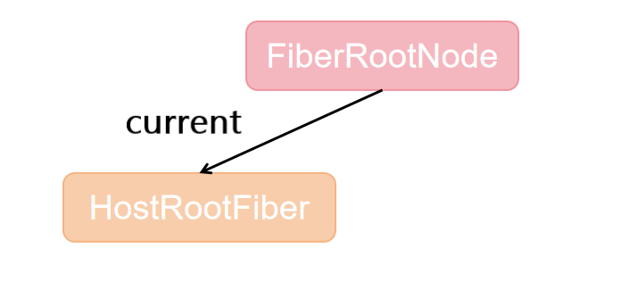
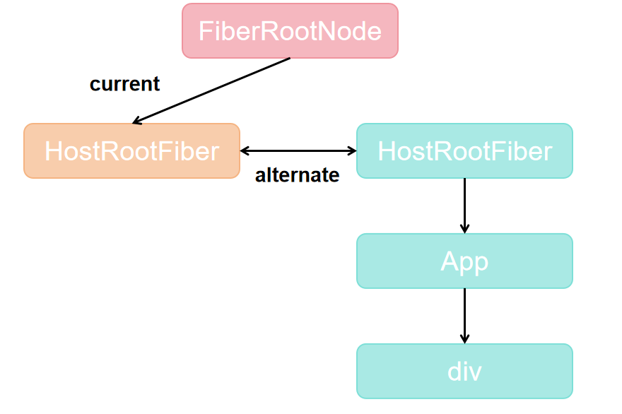
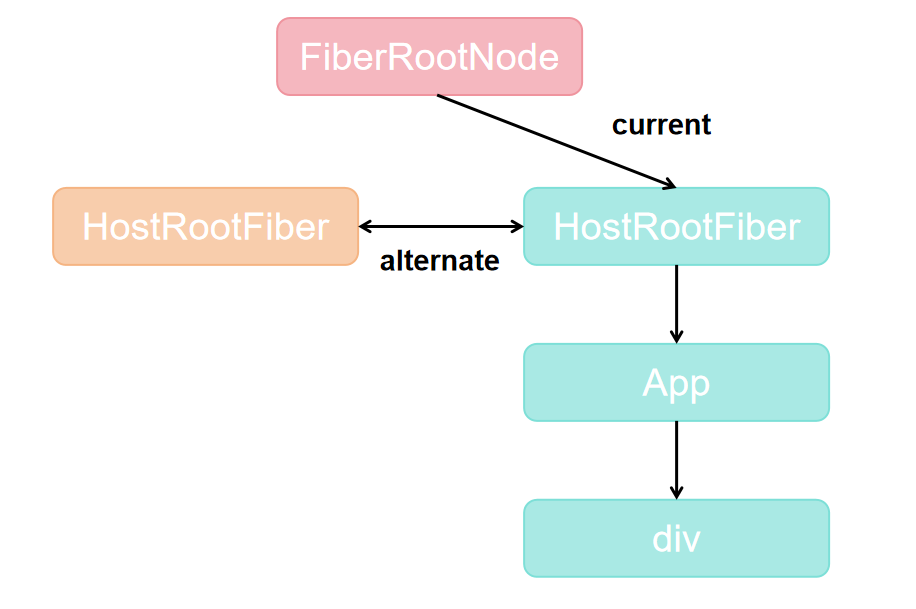
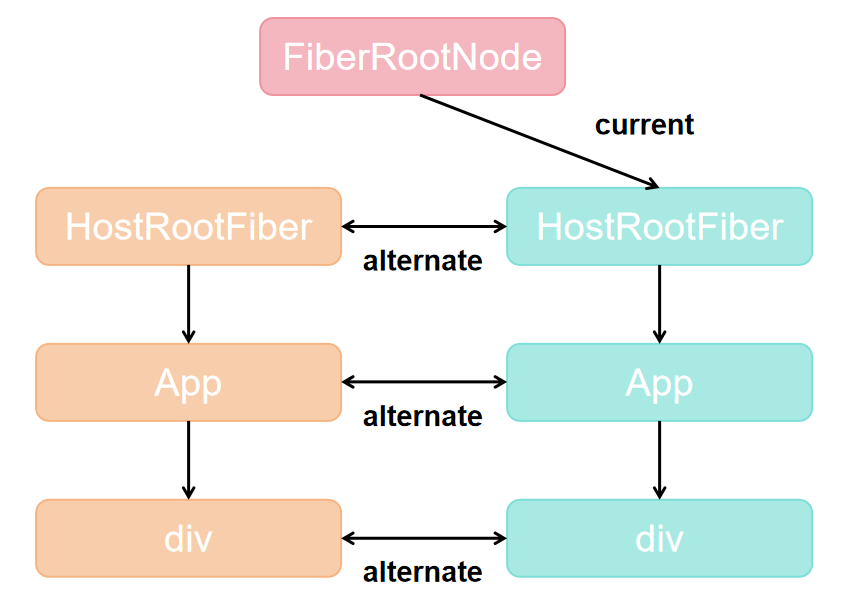
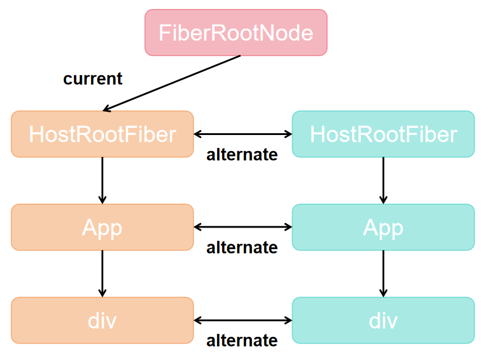

在 React 中，Fiber 是核心架构之一。理解 Fiber 以及其双缓冲机制，对于掌握 React 的底层运行原理非常重要。

<!-- truncate -->

## 对 Fiber 的理解

React 中的 Fiber 可以从三个维度去理解：

1. 一种架构 ———— Fiber 架构

在 React v16 之前，使用的是 Stack Reconciler，也就是基于栈的递归方式来进行更新调和。这种方式的缺点是：一旦任务开始，无法中断，导致页面卡顿。

从 React v16 开始，React 引入了 Fiber 架构，通过链表的方式将各个 FiberNode 串联，替代了递归方式的 Stack 架构，具备可中断、可恢复的调度能力。

```
function FiberNode(tag, pendingProps, key, mode) {
  this.return = null;   // 父节点
  this.child = null;    // 子节点
  this.sibling = null;  // 兄弟节点
  this.index = 0;
}
```

2. 一种数据类型 —— FiberNode

Fiber 本质上也是一个对象，是在之前 React 元素基础上的一种升级版本。每个 FiberNode 对象里面会包含 React 元素的类型、周围链接的FiberNode以及 DOM 相关信息。

```
function FiberNode(tag, pendingProps, key, mode) {
  this.tag = tag;           // 节点类型
  this.key = key;
  this.elementType = null;
  this.type = null;
  this.stateNode = null;    // 对应的真实 DOM
}
```

3. 动态的工作单元

在每个 FiberNode 中，保存了本次更新中该 React 元素变化的数据，还有就是要执行的工作（增、删、更新）以及副作用的信息。

```
function FiberNode(tag, pendingProps, key, mode) {
  // 副作用相关
  this.flags = NoFlags;
  this.subtreeFlags = NoFlags;
  this.deletions = null;
  this.lanes = NoLanes;       // 当前任务的优先级
  this.childLanes = NoLanes;  // 子树任务的优先级
}
```

## Fiber 双缓冲机制

可以把 Fiber 架构中的双缓冲工作原理类似于显卡的工作原理。

### 显卡工作原理

显卡分为前缓冲区和后缓冲区。

首先，前缓冲区会显示图像，之后，合成的新的图像会被写入到后缓冲区，一旦后缓冲区写入图像完毕，就会前后缓冲区进行一个**互换**。

这种将数据保存在缓冲区再进行互换的技术，就被称之为**双缓冲技术**。

### Fiber 架构

在 Fiber 架构中同样用到了该技术

- 前缓冲区（Current Tree）：当前页面正在显示的 UI

- 后缓冲区（WIP Tree）：内存中正在构建的新 Fiber Tree

当新的 WIP Tree 构建完成后，React 会把它和 Current Tree 进行切换，完成 UI 更新。这种方式避免了直接修改当前正在使用的树，从而提升性能与流畅度。

在 React 源码中，很多方法都需要接收两颗 FiberTree：
```
function cloneChildFibers(current, workInProgress){
  // ...
}
```
current 指的就是前缓冲区的 FiberNode，workInProgress 指的就是后缓冲区的 FiberNode。

两个树之间通过 ```alternate``` 指针互相连接：
```
current.alternate = workInProgress;
workInProgress.alternate = current;
```

### mount 阶段（首次渲染）

在首次渲染时，React 会创建 FiberRootNode 和对应的 HostRootFiber，然后开始构建 WorkInProgress Fiber Tree（WIP Tree）。

1. 创建 FiberRootNode

这是 React 应用的入口，记录着应用的任务调度信息，并通过 **current** 指向一棵 Fiber 树。


2. 生成 WIP Tree

React 根据 JSX 元素，采用 **深度优先遍历** 的方式，依次为每个组件/DOM 节点创建对应的 FiberNode。

- 每个新建的 FiberNode 会通过链表结构（child、sibling、return）连接起来。

- 每个 WIP 节点会通过 **alternate** 指针与对应的 Current 节点关联。

- 首次渲染时，Current Tree 只有一个 HostRootFiber，因此只有它能建立关联。

例子：
```
function App(){
  const [num, add] = useState(0);

  return (
  	<div onClick={() => add(num + 1)}>{num}</div>
  );
}

const rootElement = document.getElementById("root");
ReactDOM.createRoot(rootElement).render(<App />);
```


3. 完成渲染

当整棵 WIP Tree 构建完成后，React 将它交给 Renderer，由 Renderer 负责把 DOM 渲染到页面上。

4. 完成双缓冲切换

渲染完毕后，FiberRootNode.current 会从原来的 HostRootFiber 指向新生成的 WIP Tree，此时：

- 新的 WIP Tree → 升级为 Current Tree

- 曾经的 Current Tree（只有 root 节点） → 退化为旧树


mount 阶段的双缓冲作用在于初始化一棵完整的 WIP Tree，并完成第一次 Current 与 WIP 的切换。

### update 阶段（更新流程）

当用户交互或状态改变时，React 会触发更新，这时双缓冲机制的作用就更明显了。

1. 触发更新

```
function App(){
  const [num, add] = useState(0);

  return (
  	<div onClick={() => add(num + 1)}>{num}</div>
  );
}
```
用户点击 div 元素触发 setState，React 会启动调度，进入 update 流程。

2. 生成新的 WIP Tree

- React 会基于当前的 Current Tree 重新创建一棵新的 WIP Tree。

- 新 WIP Tree 的每个 FiberNode 会复用上一次的 FiberNode，并通过 **alternate** 属性与之关联。

- 这一步发生在内存中，页面 UI 不会立即变化。



3. 完成 WIP Tree 构建

当新的 WIP Tree 全部构建完毕后，React 会进入 commit 阶段，把 WIP Tree 对应的 DOM 更新应用到页面。

4. 完成双缓冲切换

- WIP Tree → 升级为 Current Tree

- 原先的 Current Tree → 退化为新的 WIP Tree，等待下一次更新



update 阶段的双缓冲机制让 React 可以在内存中逐步构建新树，并且可以被打断、恢复，等到完整树准备好后再一次性交换，保证了 UI 更新的流畅和一致性。

**综上所述，Fiber 双缓冲机制就是通过维护 Current Tree（正在显示） 与 WIP Tree（后台构建） 两棵树，在 mount 阶段完成首次初始化切换，在 update 阶段反复交替复用，从而实现高效、流畅、可中断的 UI 渲染。**

:::tip
开发者是可以在一个页面创建多个应用的,比如：
```
ReactDOM.createRoot(rootElement1).render(<App1 />);

ReactDOM.createRoot(rootElement2).render(<App2 />);

ReactDOM.createRoot(rootElement3).render(<App3 />);
```
在上面的代码中，创建了 3 个应用，此时就会存在 3 个 FiberRootNode，以及对应最多 6 棵 Fiber Tree。
:::