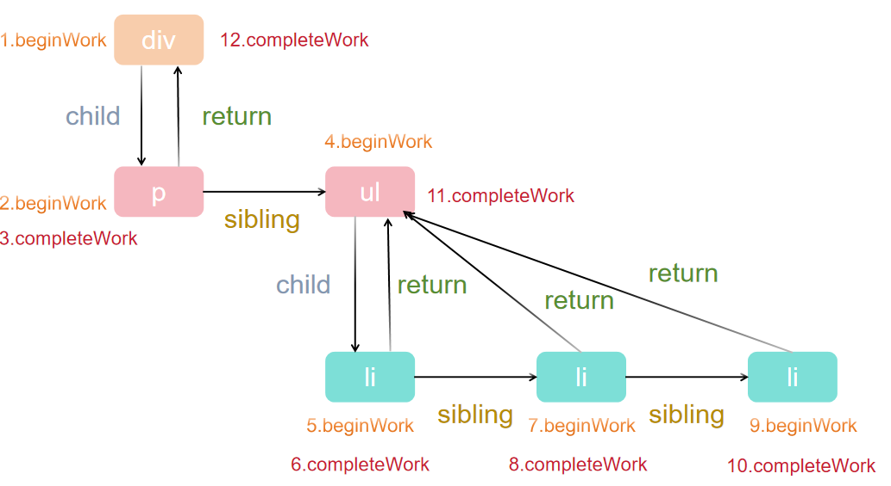

React 整体的渲染流程可以分为两大阶段，分别是 render 阶段和 commit 阶段。
render 阶段里面会经由调度器和协调器处理，此过程是在内存中运行，是异步可中断的。
commit 阶段会由渲染器进行处理，根据副作用进行 UI 的更新，此过程是同步不可中断的，否则会造成 UI 和数据显示不一致。

<!-- truncate -->

## 调度器（Scheduer）

在 React v16 版本之前，采用的是 Stack 架构，所有任务只能同步进行，无法被打断，这就导致浏览器可能会出现丢帧的现象，表现出卡顿。React 为了解决这个问题，从 v16 版本开始从架构上面进行了两大更新：
- 引入 Fiber
- 新增了 Scheduler

Scheduler 在浏览器中使用其原生 API [requestIdleCallback](https://developer.mozilla.org/zh-CN/docs/Web/API/Window/requestIdleCallback) 可以实现类似的效果。

虽然浏览器有类似的 API，但是 React 团队并没有使用该 API，因为该 API 存在兼容性问题。因此 React 团队自己实现了一套这样的机制，这个就是**调度器 Scheduler**。

后期 React 团队打算单独发行这个 Scheduler，这意味着调度器不仅仅只能在 React 中使用，凡是有涉及到任务调度需求的项目都可以使用 Scheduler。

## 协调器（Reconciler）

协调器是 render 阶段的第二阶段工作，类组件或者函数组件本身就是在这个阶段被调用的。

### 执行入口

根据调度方式的不同，协调器可能会走两条路径：

1. performSyncWorkOnRoot（同步更新流程）
```
function workLoopSync(){
  while(workInProgress !== null){
    performUnitOfWork(workInProgress)
  }
}
```

2. performConcurrentWorkOnRoot（并发更新流程）
```
function workLoopConcurrent(){
  while(workInProgress !== null && !shouldYield()){
    performUnitOfWork(workInProgress)
  }
}
```
区别在于：并发模式下会调用 shouldYield 判断是否需要中断，避免长时间占用主线程。

### Fiber Tree 构建

React 使用 Fiber 节点（FiberNode 对象） 来描述 DOM 结构。
这些节点通过 child、sibling、return 三个属性串联成一棵链表形式的 Fiber Tree。

- workInProgress 表示当前正在处理的 Fiber 节点

- 当 workInProgress 为 null 时，说明 Fiber Tree 已经构建完毕

### 工作流程

performUnitOfWork 是协调器的核心函数。它在创建 FiberNode 时，整体流程可分为两个阶段：

1. 递阶段（beginWork）

- 从 HostRootFiber 开始，深度优先遍历

- 遍历到的每个 FiberNode 调用 beginWork，创建子节点

示例 1：单个子节点
```
<ul>
  <li></li>
</ul>

// 连接关系
LiFiber.return = UlFiber;
```

示例 2：多个子节点
```
<ul>
  <li></li>
  <li></li>
  <li></li>
</ul>

// 子 Fiber 串联
Li0Fiber.sibling = Li1Fiber;
Li1Fiber.sibling = Li2Fiber;

// 父子连接
Li0Fiber.return = UlFiber;
Li1Fiber.return = UlFiber;
Li2Fiber.return = UlFiber;
```

2. 归阶段（completeWork）

- 当节点无法继续向下时，进入归阶段

- 执行 completeWork，收集副作用

- 如果有兄弟节点，则进入兄弟的递阶段；否则回溯父节点

```
function performUnitOfWork(fiberNode) {
  // 递阶段：处理子节点
  if (fiberNode.child) {
    performUnitOfWork(fiberNode.child);
  }
  // 归阶段：处理副作用
  // ...
  // 遍历兄弟节点
  if (fiberNode.sibling) {
    performUnitOfWork(fiberNode.sibling);
  }
}
```



## 渲染器（Renderer）

Renderer 工作的阶段被称之为 commit 阶段。该阶段会将各种副作用 commit 到宿主环境的 UI 中。

相较于之前的 render 阶段可以被打断，commit 阶段一旦开始就会**同步**执行直到完成渲染工作。

整个渲染器渲染过程中可以分为三个子阶段：

- BeforeMutation 阶段

- Mutation 阶段

- Layout 阶段

