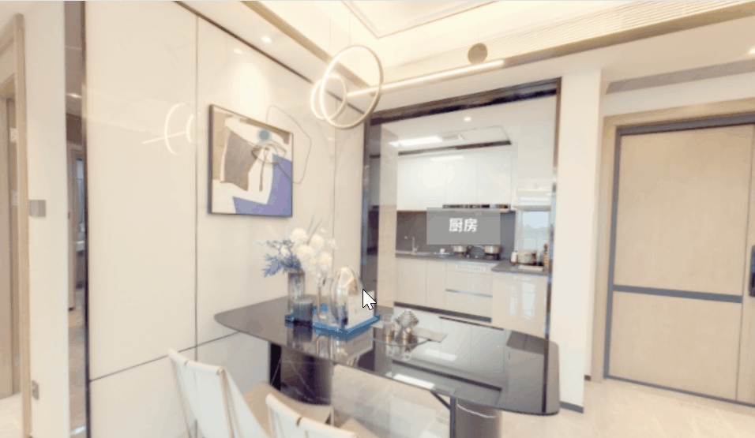

这段时间刚好对 VR 看房产生了兴趣，于是我查了一些资料，决定动手用 [Three.js](https://threejs.org/) 来实现一个简单的 VR 看房小项目。当然，这并不是要做成一个完整的产品。对我来说，这更像是一次实践练习：一方面借机学习 Three.js 的基础用法，另一方面也能在项目中巩固自己对 React 的理解。同时，这个过程还能让我锻炼如何从零开始搭建项目，并在遇到问题时尝试独立解决。

<!-- truncate -->

## 为什么选择 Three.js？

在做这个项目之前，我查阅了一些资料，简单地对比了几种方案：

- **浏览器原生 WebGL**

浏览器原生 WebGL 的底层虽然很强大，但是需要自己写着色器、管理矩阵和缓冲区等，光是一个立方体就要几十上百行代码，而我想要快速搭建一个项目，因此对于我来说，太过复杂了。

- **其他的 3D 引擎（比如 Babylon.js、Unity）**

这些 3D 引擎的功能更加全面，可以做出很酷炫的效果，但是学习成本高，而且像 Unity 这种还需要额外打包才能跑在 Web 上，我并不是要做一个很完整的产品，所以对我来说有点“杀鸡用牛刀”了。

- **Three.js**

对比之下，Three.js 对于我来说非常友好，它封装了 WebGL 的复杂细节，提供了场景、相机、光源、材质、几何体等常用 API，让我能快速上手。同时，它的社区和资料很丰富，有大量的案例和教程，遇到问题就可以很快找到解决思路。

因此，Three.js 对我来说是一个非常合适的选择，它既能帮助我快速搭建 VR 看房的基础场景，又能让我逐步理解 WebGL 背后的渲染原理。

## 开发过程中关键点

### 相机参数调试

```tsx
const camera = new THREE.PerspectiveCamera(
  75, // 视角 (FOV) - 垂直视野角度
  window.innerWidth / window.innerHeight, // 宽高比 - 必须与显示区域匹配
  0.1, // 近裁剪面 - 小于此距离的对象不渲染
  1000 // 远裁剪面 - 大于此距离的对象不渲染
);
```
:::tip
- FOV（视角）：75度是较自然的角度，过大导致鱼眼效果，过小产生望远镜效果
- 宽高比：必须与 canvas 容器的宽高比一致，否则场景会被拉伸变形
:::

### 渲染循环

```tsx
const renderer = new THREE.WebGLRenderer();
renderer.setSize(window.innerWidth, window.innerHeight);
const render = () => {
  renderer.render(scene, camera);
  requestAnimationFrame(render);
}
```
render 函数形成渲染循环，保证每一帧都渲染一次场景，从而可以看到物体的旋转、移动、交互等动态效果。可以说，render 函数是 Three.js 动画的“心跳”，没有它场景会停在初始化的第一帧，不会动。

### 自定义相机控制器

```tsx
let isMouseDown = false;
const handleMouseDown = () => {
  isMouseDown = true;   // 鼠标按下时，开启旋转状态
};
const handleMouseUp = () => {
  isMouseDown = false;  // 鼠标松开时，关闭旋转状态
};
const handleMouseOut = () => {
  isMouseDown = false;  // 鼠标移出容器时，关闭旋转状态
};
const handleMouseMove = (event: MouseEvent) => {
  if (isMouseDown) {
    // 更新相机的欧拉角（rotation），实现“拖拽看房/环视”的效果。
    camera.rotation.x += event.movementY * 0.01;
    camera.rotation.y += event.movementX * 0.01;
    // 指定旋转顺序，避免万向锁问题
    camera.rotation.order = "YXZ";
  }
};
```
在 Three.js 中也有自带的 *OrbitControls* 有类似的功能，但没有选择使用 *OrbitControls* 的原因是因为它是相机围绕一个目标点打转，比较适合看模型或查看物体。但在 VR 看房的场景里，用户的“视角”更像是固定在房间里的人头，通过拖拽或陀螺仪旋转来改变朝向，而不是绕着一个点公转。

所以会选择自定义相机控制器，保证相机位置固定在房间中心，只改变相机的旋转角度，更加符合真实的“原地环顾”体验。而且，自定义相机控制器有着**更轻量可控、自由度高、兼容性更好**的特点，与 VR 场景更加贴合。

### 3D 场景构建与纹理贴图

我单独封装了 *Room.ts* 来创建真实的 3D 房间环境，在构建立方体房间时主要的关键点是纹理贴图的正确映射：

```ts
const geometry = new THREE.BoxGeometry(10, 10, 10);
geometry.scale(1, 1, -1); // 关键步骤：反转Z轴
const arr = [
  `${roomPrefix}_r`, // 右
  `${roomPrefix}_l`, // 左
  `${roomPrefix}_u`, // 上
  `${roomPrefix}_d`, // 下
  `${roomPrefix}_f`, // 前
  `${roomPrefix}_b`, // 后
];
```
- 使用 *geometry.scale(1, 1, -1)* 反转Z轴，让贴图能够显示在立方体内侧，确保观察者在立方体内部时能看到正确的视角
- 严格按照Three.js的立方体贴图顺序（右、左、上、下、前、后）加载纹理
- 采用统一的命名约定简化纹理管理

### 创建可点击切换房间的精灵(Sprite)

因为 Sprite 是一个总是面朝着摄像机的平面，所以非常适合用作 3D 标签。要创建 Sprite，首先需要创建可点击的“图标”，这里用 *Canvas* 生成文字贴图。
```ts
const canvas = document.createElement("canvas");
canvas.width = 1024;
canvas.height = 1024;
const context = canvas.getContext("2d")!;
context.fillStyle = "rgba(100,100,100,.7)";
context.fillRect(0, 256, canvas.width, canvas.height / 2);
context.textAlign = "center";
context.textBaseline = "middle";
context.font = "bold 200px Arial";
context.fillStyle = "white";
context.fillText(text, canvas.width / 2, canvas.height / 2);
const texture = new THREE.CanvasTexture(canvas);
const material = new THREE.SpriteMaterial({
  map: texture,
  transparent: true,
})
```
接下来将文字贴图转为 *Sprite*，并加入到场景中。
```ts
const sprite = new THREE.Sprite(material);
sprite.position.copy(position);
this.sprite = sprite;
scene.add(sprite);
```

要实现点击切换房间的效果，则要让 sprite 能够响应鼠标点击，这里就需要用到 Three.js 提供的射线投射工具 ———— **[raycaster](https://threejs.org/docs/?q=raycaster#api/zh/core/Raycaster)**，它是用于进行鼠标拾取（在三维空间中计算出鼠标移过了什么物体）。

:::tip
这里注意要把鼠标坐标归一化为设备坐标，即把鼠标坐标从屏幕坐标系转为 Three.js 的投射坐标系。
转换规则如下：
```ts
pointer.x = (event.clientX / window.innerWidth) * 2 - 1;
pointer.y = -(event.clientY / window.innerHeight) * 2 + 1;
```
Three.js 的 NDC y 方向向上为正，而浏览器坐标 y 方向向下为正，所以需要取反。
:::

在点击切换房间时，我使用了 **GSAP 动画库**来改变相机位置。例如，当用户点击“阳台” Sprite 时，相机会平滑移动到 (0,0,-10)，实现类似 “跳转视角到阳台” 的效果。
```tsx
balconySprite.onClick(() => {
  gsap.to(camera.position, {
    duration: 1,
    x: 0,
    y: 0,
    z: -10,
  });
});
```

### 鼠标悬浮提示(Tooltip)

鼠标悬浮提示同样需要创建 Sprite，当鼠标悬停到目标 tooltipSprite 上时，会显示对应的提示框，而提示框的位置计算是个关键点。
```tsx
// spriteList 存放 tooltipSprite 数组
const intersects = raycaster.intersectObjects(spriteList);
if (intersects.length > 0 && intersects[0].objectuserData.type === "information") {
  // 得到 HTML 元素的中心坐标，用于后续将目标 tooltipSprite 坐标映射到屏幕坐标。
  const element = event.target as HTMLElement;
  const elementWidth = element.clientWidth / 2;
  const elementHeight = element.clientHeight / 2;
  
  const worldVector = new THREE.Vector3(
    intersects[0].object.position.x,
    intersects[0].object.position.y,
    intersects[0].object.position.z
  );
  // 得到目标 tooltipSprite 的 NDC 坐标
  const position = worldVector.project(camera);
  // 计算出目标 tooltipSprite 的 left 值
  const left = Math.round(
    elementWidth * position.x +  
    elementWidth -
    tooltipBox.current!.clientWidth / 2
  );
  // 计算出目标 tooltipSprite 的 top 值
  const top = Math.round(
    -elementHeight * position.y +
    elementHeight -
    tooltipBox.current!.clientHeight / 2
  );
  // 设置目标 tooltipSprite 的位置
  setTooltipPosition({
    left: `${left}px`,
    top: `${top}px`,
  });
  ...
```
:::tip
- ```elementWidth * position.x``` 是目标 tooltipSprite 的 NDC x 坐标相对于画布中心的像素偏移量，后面 ```+ elementWidth``` 是以画布左上角作为原点坐标，得出目标 tooltipSprite 的 x 坐标，```- tooltipBox.current!.clientWidth / 2``` 是要将提示框水平居中。
- 同理，``` -elementHeight * position.y``` 是目标 tooltipSprite 的 NDC y 坐标相对于画布中心的像素偏移量(取负是因为NDC y 轴向上为正，而浏览器 DOM y 轴向下为正)，后面 ```+ elementHeight``` 是以画布左上角作为原点坐标，得出目标 tooltipSprite 的 y 坐标，```- tooltipBox.current!.clientHeight / 2``` 是要将提示框垂直居中。
:::

## 踩坑与解决办法

### 窗口大小变化

窗口大小变化时，相机比例和渲染器大小没有更新，导致了画面没办法及时适应窗口大小变化，需要页面刷新才可以。

对此，需要监听 resize 事件，更新相机比例和渲染器大小。
```tsx
const handleResize = () => {
  // 1. 更新相机的宽高比（aspect ratio）
  camera.aspect = window.innerWidth / window.innerHeight;

  // 2. 通知相机用新的宽高比重新计算投影矩阵
  camera.updateProjectionMatrix();

  // 3. 更新渲染器尺寸，确保渲染的画布与窗口一致
  renderer.setSize(window.innerWidth, window.innerHeight);
};

// 调用时：
window.addEventListener('resize', handleResize);
```

### 渲染器 DOM 被重复添加

在我的 useEffect 中：
```tsx
useEffect(() => {
 ...
 container.current?.appendChild(renderer.domElement);
 ...
}, []);
```
我加了空依赖[ ]，在理论上这行代码只会被执行一次，但在 DOM 中却看到两个 canvas，原因是因为 React 默认在开发环境下会开启 **StrictMode**，因此在开发模式下会执行 useEffect 两次，从而导致 renderer.domElement 被添加两次。

解决办法也很简单，就是在开发环境下去掉 **StrictMode**，这样 useEffect 就只执行一次，不会产生重复 DOM。

在 main.tsx 中：
```tsx
// createRoot(document.getElementById('root')!).render(
//   <React.StrictMode>
//     <App />
//   </React.StrictMode>
// );

createRoot(document.getElementById('root')!).render(<App />);
```

### 性能问题

在最初的实现里，我每次进入 VR 场景都会新建一个 renderer，还不断往 window、container、tooltipBox 上绑定事件监听器，却没有在组件卸载时清理。从而导致的结果就是：
- 内存占用越来越高；
- 渲染器对象叠加，导致显卡资源被反复占用；
- 鼠标事件触发多次，调试时很难定位问题。

原因是因为 React 组件有挂载和卸载的生命周期，而 Three.js 并不会自动清理资源。如果忘记移除监听器和销毁渲染器，就会出现内存泄漏和性能下降的问题。

对此解决办法就是在 useEffect 的清理函数里统一释放资源：
```tsx
useEffect(() => {
  ...
  // 添加事件监听器
  window.addEventListener('resize', handleResize);
  renderer.domElement.addEventListener('mousemove', tooltipShow);
  tooltipBox.current.addEventListener('mouseleave', handleTooltipHide as any);
  container.current.addEventListener('mousedown', handleMouseDown);
  container.current.addEventListener('mouseup', handleMouseUp);
  container.current.addEventListener('mouseout', handleMouseOut);
  container.current.addEventListener('mousemove', handleMouseMove);

  // 清理函数
  return () => {
    // 移除 window 事件
    window.removeEventListener('resize', handleResize);

    // 移除容器中的 canvas 和事件
    if (container.current) {
      container.current.removeChild(renderer.domElement);
      container.current.removeEventListener('mousedown', handleMouseDown);
      container.current.removeEventListener('mouseup', handleMouseUp);
      container.current.removeEventListener('mouseout', handleMouseOut);
      container.current.removeEventListener('mousemove', handleMouseMove);
    }

    // 移除 tooltip 事件
    tooltipBox.current?.removeEventListener('mouseleave', handleTooltipHide as any);

    // 销毁渲染器，释放内存和显存
    renderer.dispose();
  };
}, []);
```

## 成果展示




目前实现的功能：

- 能够进入房间，环视房间场景

- 支持切换房间

- 鼠标悬浮到提示点上，能够显示提示信息

## 总结

说实话刚开始做这个项目我心里完全没底，只是单纯觉得应该挺酷的，想试试看。结果一边查资料、一边踩坑，慢慢地，居然把一个能用的 Demo 搭出来了，搭建的过程比我想象中更有趣。目前这个项目在整体上还比较简陋，但是已经能完整跑通“VR 看房”的基本流程了。

### 收获

针对这次的项目，我也有了一些收获：

- 首先是对于 Three.js 的认知，从刚开始对文档以及API的不熟悉，到现在能够逐渐理解相机、场景、渲染器等这些核心概念之间的关系。踩过几次坑之后，对 3D 场景的坐标和贴图方向也算有了直观的理解。

- 其次就是对 React 有了进一步的理解，在 React 中集成 Three.js 需要注意生命周期管理。最初因为忘记清理渲染器和事件监听器，导致了性能问题，这让我对 React 的 useEffect 清理函数有了更深的理解。同时，也体会到 React 的严格模式 (StrictMode) 对调试的影响，这在实际项目里是很容易忽略的坑。

- 最后就是一些额外的收获，在做项目过程中，其实一个功能的实现有时候会有很多的选择，而这个时候就需要进行思考，到底哪一种方案更加合适，这也在无形之中锻炼了我的思维能力。

### 未来展望

目前的功能还比较基础，比如房间切换和简单的 Tooltip 提示。后续可以考虑加入更多的交互（比如虚拟漫游、物品交互、装修模拟等）来提升 VR 的沉浸感，形成一个更加完整的产品。

对于项目的代码，可以进行优化架构来提升可维护性与性能，比如：将场景中的精灵对象（导航点、提示点）纳入一个全局管理器进行集中控制，以及对 3D 模型和纹理实施更精细的加载与缓存策略，并重构事件监听逻辑以避免潜在的性能瓶颈等。