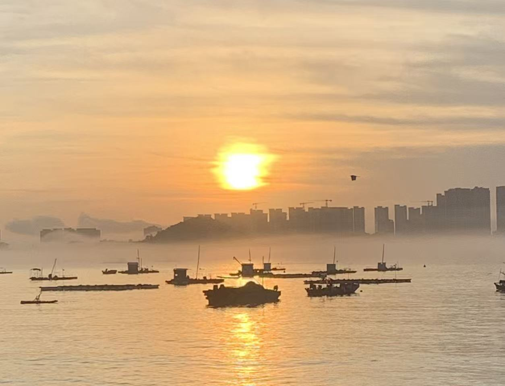
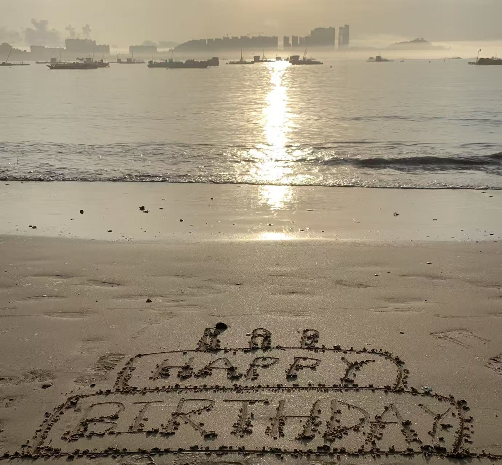
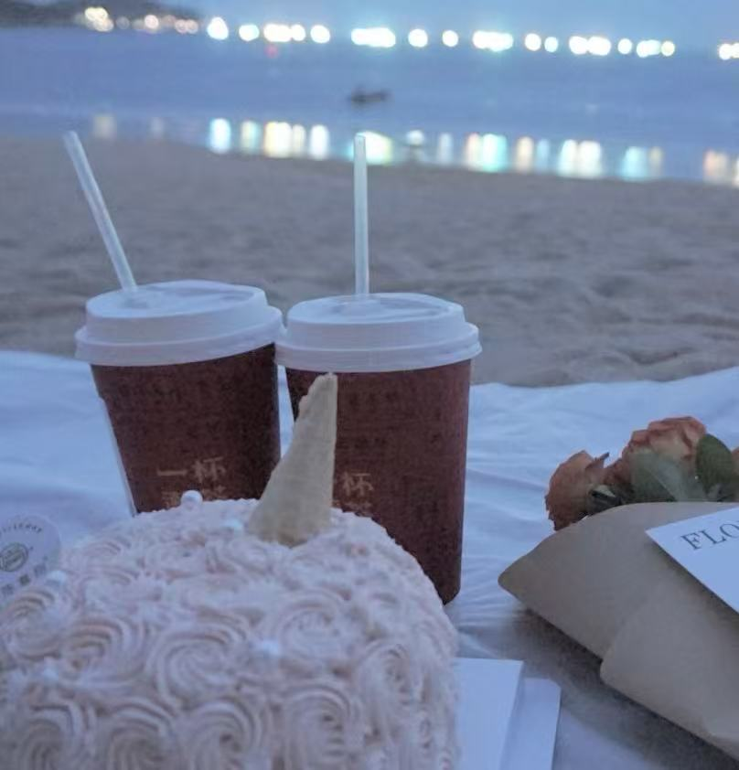
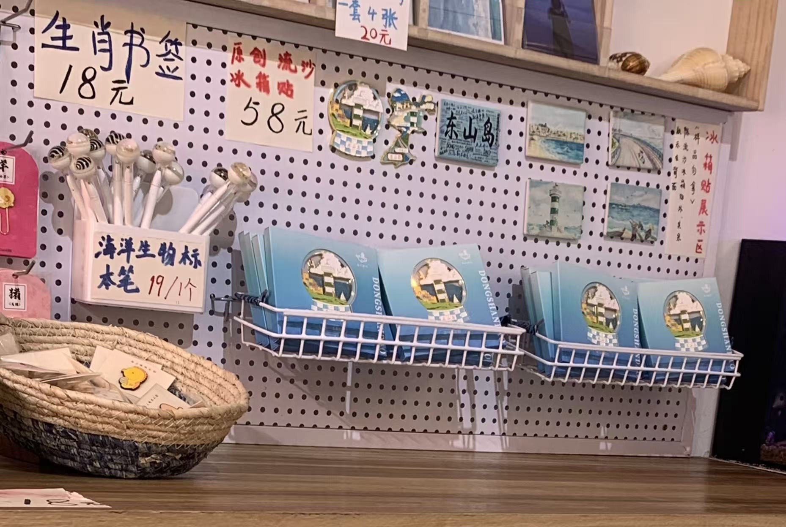
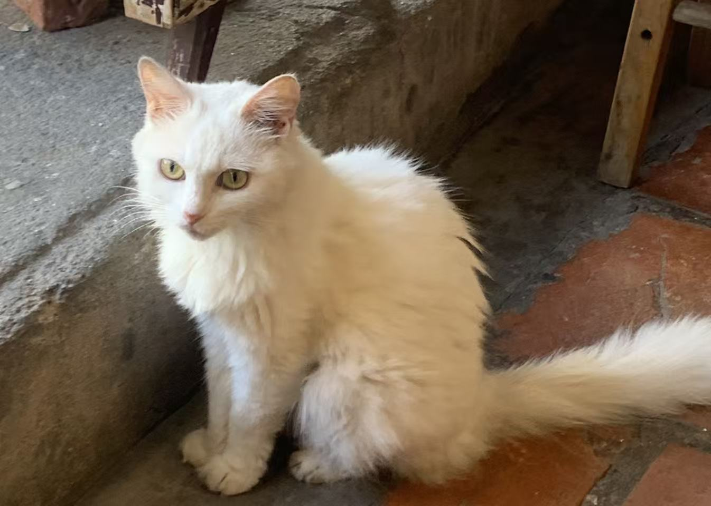

有些旅行，不需要过多筹备，只需要一个念头和一份冲动。东山岛之行就是这样，一场说走就走的旅程。

<!-- truncate -->

## 突发的决定

跟好友聊天时突然提到，好像很久没有一起出去玩了，讨论了一下，决定去之前一直想去却因为各种事情耽搁没去成的东山岛。决定之后，我们立刻定下来隔天的车，直接包车前往东山岛。酒店挑了一会，最终定下来一间民宿，好在到了之后没有踩雷，民宿老板人很好，家里还有可爱的小狗（看到小狗就走不动道了哈哈）。这场旅行没有攻略，没有计划，只是因为一次突发奇想，就这样开启了。有些时候，自由往往就藏在这些看似冲动的决定里。

## 惬意的骑行

到达的第一件事，就是租下小电动车。在海岛上，电动车无疑是最方便的交通工具。从岛的这一头到那一头，我们几乎把东山岛的每一片海都看遍了。海风迎面扑来，咸味混着阳光，骑行的自由感让人忍不住放声大笑。没有目的地的旅行，反而最能感受旅途的松弛。走走停停，累了就歇下，看着眼前的海浪一波一波涌来，心也被拍得很安静。旅行的意义，或许并不在远方，而在路途中的每一次呼吸和放松。

## 海边的生日

旅途的第二天，恰好是我的生日。前一晚心血来潮，临时决定去看日出。上一次看日出，已经是小学时候了。清晨醒来时，却发现雾气弥漫，天色灰蒙蒙的。那一刻心里有些失落，但既然已经起床，还是和朋友骑上车出发。

我们开着小电动，沿着通往海边的路骑行，越接近目的地，那雾气逐渐散去，天边开始泛起微光。仿佛是命运的小小馈赠，就在生日的清晨，让我重新见证了久违的日出。站在海边，看太阳一点点升起，海面被金色铺满，那一刻心里有一种说不出的满足感。

傍晚时分，我和朋友带着蛋糕、奶茶和鲜花，再一次来到海边，为自己庆祝生日。第一次坐在沙滩上，脚下是细软的沙，耳边是轻轻拍打的海浪声，微风拂过脸颊，我在心里悄悄许下生日愿望。

我们并肩而坐，边品尝蛋糕，边聊着未来的憧憬。橘红色的晚霞洒在海面上，海浪轻轻卷起，像为这一刻铺上柔软的背景。笑声、海风、甜品的香味交织在一起，温暖而宁静。那一刻，我真切地感受到，大海总有一种魔力，让人暂时忘却烦恼，让心灵得以安放。生日和旅行，在这一刻交织成了最治愈的记忆。

## 留存的纪念

返程的那天，我和朋友特意骑车去了岛上的一些文创小店。我们在一家店里写下了明信片，寄给未来的自己，也算是为这段旅程留个印记。离开前，我买了一个冰箱贴。对我来说，每次旅行都会带回一些当地的小物件 ———— 冰箱贴、明信片或者钥匙扣。它们比照片更真实，因为能被触碰、能在日常生活中不经意撞见，就像是被封存的时光，提醒着我“我来过这里”。记忆有时会褪色，但这些小小的物件，却能唤醒被遗忘的风声与笑声。

（附上文创店的可爱小猫🐈一张）

短短几天的东山岛之旅，我感受到了前所未有的的治愈，它在那个海边的清晨与傍晚，跟我一起度过了我 23 周岁的生日，为我留下了独一无二的生日礼物，也替我保管了那个夏天最温柔的记忆。