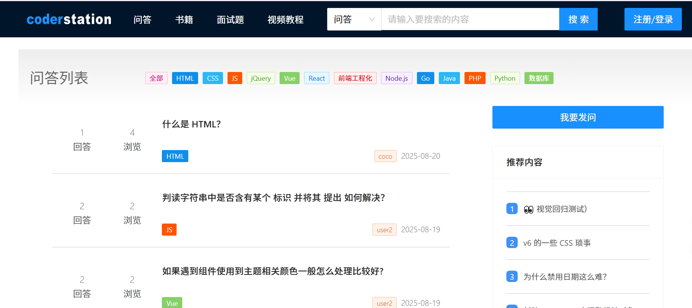
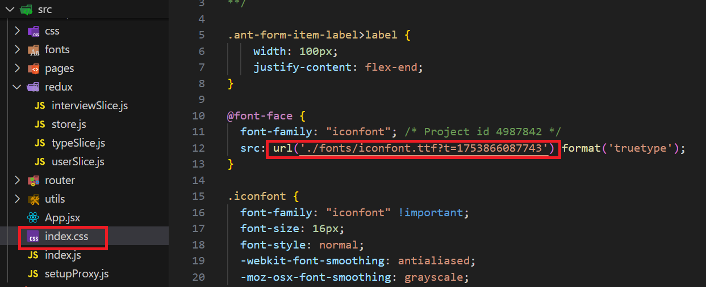

最近完成了一个小项目，整个过程让我收获颇多。最初的想法其实很简单：我想通过这个项目，把之前学到的一些前端知识真正用起来。相比于看教程，项目更能暴露出自己不足的地方，也更能让我感受到学习成果的落地。

<!-- truncate -->

## 项目概述

关于这个项目的功能比较简单，它有点类似于交流的社区，可以在问答模块进行交流。同时，它还包含了书籍、面试题以及视频等板块，提供了学习的资料和途径。



- 项目是由 **Create React App** 创建的，它能够提供开箱即用的配置，简化了项目的启动过程。
```
npx create-react-app my-app
cd my-app
npm start
```
React 官网：https://zh-hans.legacy.reactjs.org/docs/getting-started.html

- 项目的前端路由使用的是 **React Router**，使用前需先安装依赖
```
npm i react-router-dom
```
React Router 官网：https://reactrouter.com

- 项目的状态管理使用的是 **Redux Toolkit**，使用前需先安装依赖
```
npm i react-redux
```
Redux Toolkit 官网：https://redux-toolkit.js.org/

- 项目使用的组件库是 **Ant Design**，使用前需先安装依赖
```
npm i antd
```
Ant Design官网：https://ant.design

### 请求转发

在使用 Create React App 构建的 React 应用中，可以通过 setupProxy.js 文件来配置请求转发。这通常用于将 API 请求代理到后端服务器，以避免跨域问题。

具体步骤如下：
1. 在 src 目录下创建一个名为 setupProxy.js 的文件。
2. 在项目中安装 http-proxy-middleware 库，用于处理请求转发。
```
npm install http-proxy-middleware --save
```
3. 在 setupProxy.js 文件中，使用 http-proxy-middleware 来配置请求转发。以下是一个基本示例：
```js
const { createProxyMiddleware } = require("http-proxy-middleware");

module.exports = function(app){
    app.use(createProxyMiddleware("/res", {
        target: "http://127.0.0.1:7001",
        changeOrigin : true
    }),createProxyMiddleware("/api", {
        target: "http://127.0.0.1:7001",
        changeOrigin : true
    }),createProxyMiddleware("/static", {
        target: "http://127.0.0.1:7001",
        changeOrigin : true
    }),)
}
```
 - target: 目标服务器的地址，所有匹配到的请求会转发到这个地址。
 - changeOrigin: 设置为 true 时，会修改请求的 Origin 头，通常用于避免 CORS 问题。

:::warning
- setupProxy.js 仅在开发环境中生效，生产环境需要配置不同的代理方式。
- 确保后端服务器正在运行，并且可以接受来自代理的请求。
:::

### 渲染出 svg 图片

在 React 中，想要渲染出一段 html 或 svg 图片，可以使用如下方式
```
<div dangerouslySetInnerHTML={{ __html: captcha }}></div>
```

### 修改打包后的目录

该项目的静态资源是以 static，所以需要配置请求转发，但是 create-react-app（基于 webpack）默认在打包应用时，会将打包好的资源也放置到 static 目录下，从而导致在加载打包好后的资源时，也会进行请求转发，最终导致报错。

解决办法是修改打包好后的目录。

运行如下命令：
```
npm run eject
```
:::warning
弹射的时候要求 git 仓库不能有未提交的文件
:::

弹射后，会多出来很多隐藏文件，这时可以修改对应的配置。

但有一个关于 Babel 的错误，最快的解决方案是在 package.json 中删除如下的配置：
```
"eslintConfig": {
    "extends": [
      "react-app",
      "react-app/jest"
    ]
},
```

下一步，在弹射出来的配置文件中，我们就可以修改 webpack 的打包配置。找到 config/webpack.config.js 的 output 对应的配置，将其进行修改
```
filename: isEnvProduction
       ? 'assets/js/[name].[contenthash:8].js'
       : isEnvDevelopment && 'assets/js/bundle.js',
     // There are also additional JS chunk files if you use code splitting.
     chunkFilename: isEnvProduction
       ? 'assets/js/[name].[contenthash:8].chunk.js'
       : isEnvDevelopment && 'assets/js/[name].chunk.js',
     assetModuleFilename: 'assets/media/[name].[hash][ext]',
```

### 关于 redux 中将异步获取到的数据填充到状态仓库

关于 redux 中将异步获取到的数据填充到状态仓库，有两种方式：

1. 通过 action 来派发一个 reducer，从而实现状态填充。
```
export const getTodoListAsync = createAsyncThunk(
  "todo/getTodoListAsync",
  async (_, thunkApi) => {
    // 发送 ajax 请求
    const response = await getTodoListAsync();
    // 派发 action
    thunkApi.dispatch(initTodoList(response.data));
  }
);
```

2. 使用 redux-toolkit 官网所示例的[方式](https://redux-toolkit.js.org/api/createAsyncThunk)。
```
export const getTypeList = createAsyncThunk(
    "type/getTypeList",
    async ()=>{
        const response = await getType();
        // 填充返回的数据到状态仓库
        return response.data;
    }
);

// ....

// 专门处理异步的 reducer
extraReducers : {
  // 这里就会有三种状态
  [getTypeList.fulfilled] : (state, { payload }) => {
    state.typeList = payload;
  }
}
```

### 自定义图标字体

在 [iconfont](https://www.iconfont.cn) 上选择需要下载的图标字体，将其添加到购物车，新建一个项目，加入到项目就可以选择下载代码。

下载完成后，是一个压缩包，解压后会得到 CSS、JS、ttf 之类的文件，将ttf 字体文件添加到项目中后，要将 src 中的 url 路径修改

修改之后，在代码中即可使用改样式
```
<span class="iconfont iconfont-jiangbei1"></span>
```

### classnames

在 React 中，如果想要设置多个类名样式，可以借助第三方库，需先进行安装
```
npm install classnames
```
安装后，即可使用，具体可查看[官方网站](https://www.npmjs.com/package/classnames)

下列用法可供参考：
```
import classname from "classnames";

const [classNameCollection] = useState({
        "iconfont": true,
        "icon-jiangbei1": true,
    })

// ···

<div
    style={{
        color: "#ffda23",
        fontSize: "22px",
    }}
    className={classname(classNameCollection)}
></div>
```

### markdown 的编辑器

在该项目的问答模块使用到的 markdown 的编辑器是 react 版本的[toast-ui edior](https://github.com/nhn/tui.editor/tree/master/apps/react-editor),详细的项目配置参考：https://nhn.github.io/tui.editor/latest/ToastUIEditor#focus

在安装时会报错，报错的原因是因为该插件内部依赖 React 17版本，所以在安装时使用强制安装即可解决问题
```
npm install --save @toast-ui/react-editor --force
```

## 心得体会

写这个项目其实花费了我不少时间，因为思路不清晰，所以每做一块功能的时候，我都需要反复查阅资料，尝试不同的方案。在开发过程中，因为大大小小的问题，页面经常报错，我也因此偶尔感到崩溃。但是当问题一个一个被解决的时候，我又能从中获得一点小小的成就感。

回过头来看，项目还有很多可以改进的地方，比如代码结构还不够清晰，文档记录也有些缺失。但正是因为有这些“不完美”，才让我看到自己未来努力的方向。

总的来说，这次项目让我把“学到的知识”真正转化成了“做出来的东西”。学习和实践的结合，是最有价值的收获。接下来，我希望能继续通过更多的项目，把前端学习的路走得更稳、更远。
