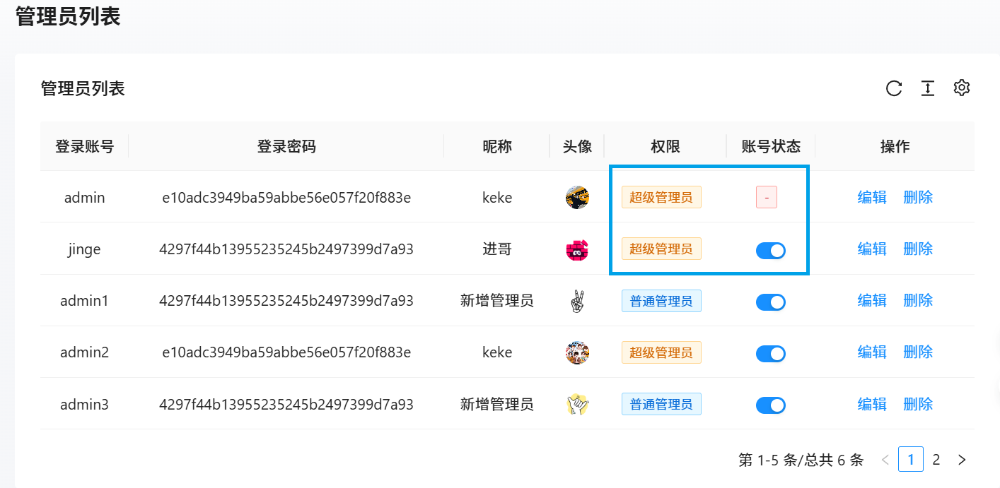

这段时间，我用 React 技术栈做了一个完整的项目。整体框架采用了 [UmiJS 4.x](https://umijs.org/)，路由用了 [react-router](https://reactrouter.com/api/components/Route)，数据流则选择了基于 redux 和 redux-saga 的 [dva](https://umijs.org/docs/max/dva)，在 UI 层面上，我直接用上了 [Ant Design Pro](https://procomponents.ant.design/) 这一整合方案。算下来，这是一套相对完整、工程化程度很高的前端技术栈。开发下来，我有一些心得和体会，想在这里做个小结。

<!-- truncate -->

## 为什么选择这一套技术

起初在做项目时，我并没有想得特别复杂，只是想快速搭起一个后台系统。而在 React 的生态里，Ant Design Pro 提供的功能最完整，它与 UmiJS 4.x 深度结合，搭配起来能快速启动中后台项目。至于数据流，dva 把 redux 和 redux-saga 打包好，用「model」这种形式组织代码，让逻辑更清晰。可以说，这一整套方案的选择，更多是出于“省心”和“稳定”的考虑。

## 开发过程中的体验

在开发过程中，我也确实体会到了这套组合的优点，我的开发效率显著提高了且项目结构也相对规范了。

我并没有选择用 UmiJS 的约定式路由，而是采用了[配置式路由](https://umijs.org/docs/guides/routes#%E9%85%8D%E7%BD%AE%E8%B7%AF%E7%94%B1)来管理页面结构，我觉得相对于约定式路由，配置式更加灵活，特别是在需要处理嵌套路由和权限控制时，写在配置里一目了然。

在状态管理方面，使用 dva 的体验非常流畅，它通过model 将 state、reducers、effects 组织在一起，数据流向清晰，异步逻辑也更易维护了。

在 UI 层面上，Ant Design Pro 真的帮我节省了不少时间。登录、权限、布局等功能几乎开箱即用，我只需要修改配置即可满足大部分需求。

### 关于配置代理服务器

配置代理服务器直接在 umirc.js 文件中进行配置，具体参考[官方文档](https://umijs.org/docs/api/config#proxy)
```
proxy : {
    "/api" : {
      target : "http://127.0.0.1:7001",
      changeOrigin : true,
    },
    "/static" : {
      target : "http://127.0.0.1:7001",
      changeOrigin : true,
    },
    "/res" : {
      target : "http://127.0.0.1:7001",
      changeOrigin : true,
    }
  },
```

### 关于 antd 表格的相关配置

在使用 antd 里的表格时，需要对每一列进行配置，具体参考[官方文档](https://ant.design/components/table-cn#Column)

例如：
```
// 对应表格每一列的配置
const columns = [{
  title : "登录账号",
  dataIndex : "loginId",
  key : "loginId",
  align : "center"
}];
```
:::tip
在配置列的时候，有些属性需要参阅 procomponents 的文档，例如[columns 列定义](https://procomponents.ant.design/components/table#columns-列定义)以及 [valueType 对应的值](https://procomponents.ant.design/components/schema#valuetype-列表)
:::

如果是单纯的渲染某一个值，直接配置 dataIndex 即可，但是在这项目中，有的需要根据数据对应的值渲染成其他的东西，例如权限和账号状态。


那么这个时候就需要用到 render 这个属性。
例如：
```
title: '权限',
dataIndex: 'permission',
key: 'permission',
align: 'center',
render: (_, row) => {
  let tag =
    row.permission === 1 ? (
      <Tag color="orange" key={row._id}>
        超级管理员
      </Tag>
    ) : (
      <Tag color="blue" key={row._id}>
        普通管理员
      </Tag>
    );
  return tag;
}
```

### 关于在 ProTable 组件中使用 request 发送请求

ProTable 有一个重要的属性叫做 request，该属性对应的值一般是一个异步函数，该异步函数自动接受一个 params，params 中会有默认的当前页码（current）和每一页的条数（pageSize），这两个值会有默认值，current 默认为 1，pageSize 默认为 20，可以通过配置 pagination 属性来修改 current 和 pageSize 的值。
```
<ProTable
  headerTitle="用户列表"
  pagination={{
    showQuickJumper: true,
    showSizeChanger: true,
    pageSizeOptions: [5, 10, 15, 20],
    ...pagination,
    onChange: handlePageChange
  }}
  request={async (params) => {
    console.log(params);
  }}
/>
```

### 关于刷新表格

当表格修改或者切换时，需要进行刷新，这里通过 actionRef 来获取表格的实例，然后调用 reload 方法，具体参考[官方文档](https://procomponents.ant.design/components/table/#actionref-手动触发)
```
<ProTable
  actionRef={tableRef}
 	...
/>
```
```
tableRef.current.reload();
```

### 关于权限设置

首先需要在构建时配置文件 umirn.js/ts 中启动 [access](https://umijs.org/docs/max/access)，之后在 src 目录下创建一个 access.js/ts 文件。

接下来在路由配置中，为每一个路由配置对应权限，例如：
```
{
  name: '首页',
  path: '/home',
  component: './Home',
  icon : "HomeOutlined",
  access : "NormalAdmin"  // 普通管理员能够访问
},
{
  name : "管理员",
  path : "/admin",
  icon: 'UserOutlined',
  access : "SuperAdmin",  // 超级管理员能够访问
  ...
},
```

最后在 access.js 文件中，根据登录的账户的 permission 来确定返回的对象。

针对页面中某一块区域如果要设置权限，那么可以通过 useAccess hook 函数获取到当前的权限对象（access.js 中我们返回的对象）

之后通过 Access 组件包裹有权限的区域，设置 accessible 属性即可。
```
<Access accessible={access.SuperAdmin}>
 	//...
</Access>
```

### 关于问题及解决方案

1. 在初次渲染组件的时候，设置了数据的回填，导致组件初次还没有渲染完毕又再更新，所以出现了以下警告：
:::warning
Warning: Cannot update a component (InternalFormItem) while rendering a different component (UserForm).
:::

解决方案是，等待第一次渲染完毕后再进行数据的回填，所以将回填的代码放入 useEffect 即可。
```
useEffect(() => {
  if (formRef.current) {
    formRef.current.setFieldsValue(userInfo);
  }
}, [userInfo]);
```

2. markdown 编辑器做修改操作，对应的组件在重新渲染时 markdown 编辑器回填了数据多次，从而导致了光标跳转有问题。

解决方案是，设置一个状态值，第一次 markdown 回填了数据后，之后就不再让编辑器回填数据
```
// 编辑器是否是第一次回填
const [firstIn, setFirstIn] = useState(true);

useEffect(()=>{
  if(formRef.current && firstIn && bookInfo){
    formRef.current.setFieldsValue(bookInfo);
    // 关键就是关于编辑器的回填
    editorRef.current.getInstance().setHTML(bookInfo?.bookIntro);
    // 将 firstIn 设置为 false
    setFirstIn(false);
  }
  if(formRef.current){
    formRef.current.setFieldsValue(bookInfo);
  }
},[bookInfo])
```

## 收获和感想

整体来说，这次项目让我收获颇多。它让我体验到框架和工具带来的便利，也让我意识到背后的复杂性和取舍。更重要的是，它让我明白了：技术选型不是追求“最潮”的，而是要适合自己和项目。

就像一句话说的：**“学而知之，行而明之。”**
做项目就是最好的实践。通过一次完整的开发，我不仅掌握了工具的用法，也对它们背后的理念有了新的理解。这才是我最大的收获。
